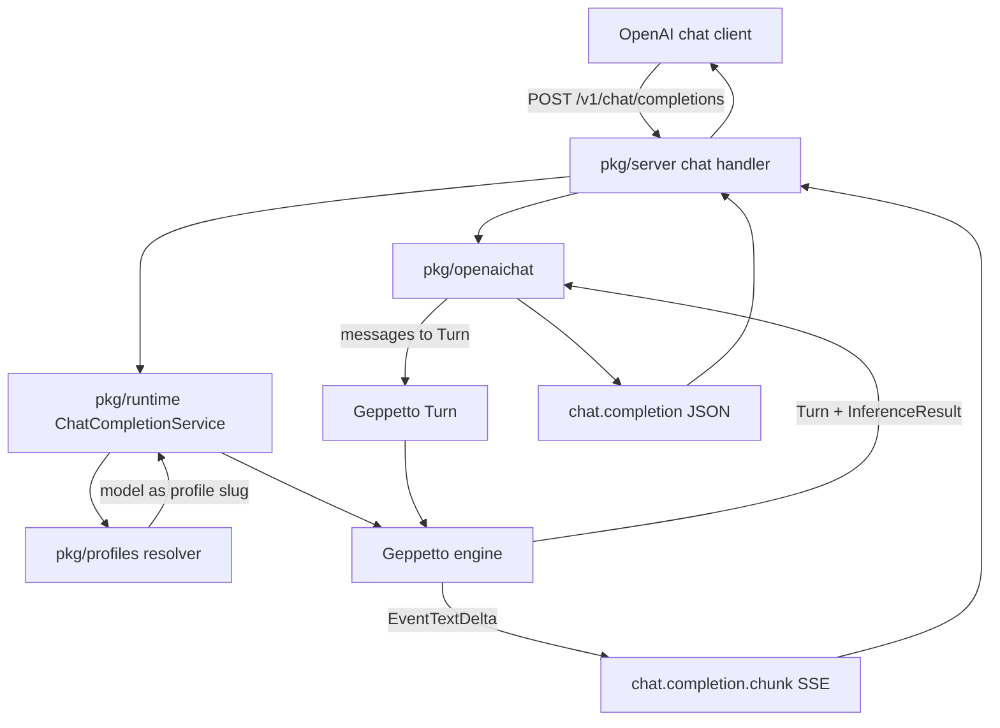

# Simple Geppetto Engine OpenAI Chat Completions Proxy Prototype

## Executive summary

The next endpoint should be `POST /v1/chat/completions`. It should follow the same architecture as the existing `/v1/completions` prototype: the request `model` is a Geppetto profile slug, provider setup remains in Geppetto profile YAML, the proxy creates a Geppetto engine from the resolved profile, and inference runs through `engine.RunInferenceWithResult`.

The difference is the boundary mapper. Completions maps one `prompt` string to one user block. Chat Completions maps an ordered `messages` array to an ordered Geppetto `Turn`. The response maps generated assistant text blocks to an OpenAI `chat.completion` response. Streaming maps Geppetto `EventTextDelta` values to `chat.completion.chunk` SSE frames with `choices[0].delta.content`.

The prototype should support the common text-only subset first:

- `role: system`, `developer`, `user`, and `assistant`
- `content` as a string
- optional `stream`
- optional token/sampling fields parsed but not applied yet

Tool calls, image parts, structured output, and full OpenAI field compatibility are deferred. The goal is to complete a working text-chat bridge quickly without changing the profile/engine architecture.

## Problem statement

The existing prototype exposes legacy `/v1/completions`, but many OpenAI-compatible clients use `/v1/chat/completions`. Chat Completions is still much simpler than OpenAI Responses because its basic text path is an ordered list of role-tagged messages and one assistant message result. It can be added by reusing the current profile resolver, engine provider, event-sink streaming path, and server structure.

The implementation should not introduce direct provider adapters. Geppetto still owns provider setup and provider execution.

## Scope

### In scope

- `POST /v1/chat/completions`.
- Non-streaming `chat.completion` responses.
- Streaming `chat.completion.chunk` SSE responses.
- Text-only messages with string `content`.
- Roles: `system`, `developer`, `user`, `assistant`.
- Request `model` interpreted as Geppetto profile slug.
- Reuse `GET /v1/models` profile slug listing.
- Fake-engine tests for mapping, non-streaming, and streaming.

### Out of scope for this increment

- Tool calls and tool results.
- Multimodal content arrays.
- `response_format`, JSON schema, structured output.
- Applying request-level inference overrides.
- Exact OpenAI compatibility for every optional field.
- `/v1/responses`.

## Architecture



## Wire types

Add a new `pkg/openaichat` package rather than expanding `pkg/openaicompletions`. The two OpenAI endpoints share some concepts but their response shapes differ enough to keep the code separate.

Minimum request type:

```go
type ChatCompletionRequest struct {
    Model       string        `json:"model"`
    Messages    []ChatMessage `json:"messages"`
    MaxTokens   *int          `json:"max_tokens,omitempty"`
    Temperature *float64      `json:"temperature,omitempty"`
    TopP        *float64      `json:"top_p,omitempty"`
    Stop        json.RawMessage `json:"stop,omitempty"`
    Stream      bool          `json:"stream,omitempty"`
}

type ChatMessage struct {
    Role    string          `json:"role"`
    Content json.RawMessage `json:"content"`
}
```

Phase 1 should accept only string content. If content is an array, return an OpenAI-style invalid request error saying multimodal content is not supported in this prototype.

Minimum non-streaming response:

```go
type ChatCompletionResponse struct {
    ID      string       `json:"id"`
    Object  string       `json:"object"` // "chat.completion"
    Created int64        `json:"created"`
    Model   string       `json:"model"`
    Choices []ChatChoice `json:"choices"`
    Usage   *Usage       `json:"usage,omitempty"`
}

type ChatChoice struct {
    Index        int         `json:"index"`
    Message      ChatMessageOut `json:"message"`
    FinishReason string      `json:"finish_reason,omitempty"`
}

type ChatMessageOut struct {
    Role    string `json:"role"`
    Content string `json:"content"`
}
```

Minimum stream chunk:

```go
type ChatCompletionChunk struct {
    ID      string              `json:"id"`
    Object  string              `json:"object"` // "chat.completion.chunk"
    Created int64               `json:"created"`
    Model   string              `json:"model"`
    Choices []ChatStreamChoice  `json:"choices"`
}

type ChatStreamChoice struct {
    Index        int        `json:"index"`
    Delta        ChatDelta  `json:"delta"`
    FinishReason *string    `json:"finish_reason"`
}

type ChatDelta struct {
    Role    string `json:"role,omitempty"`
    Content string `json:"content,omitempty"`
}
```

## Message-to-turn mapping

Mapping is direct for text-only chat:

| Chat message role | Geppetto block |
|---|---|
| `system` | `turns.NewSystemTextBlock(content)` |
| `developer` | `turns.NewSystemTextBlock(content)` for prototype simplicity |
| `user` | `turns.NewUserTextBlock(content)` |
| `assistant` | `turns.NewAssistantTextBlock(content)` |

The mapper should preserve ordering. It should reject empty `messages` and unsupported roles. It should reject non-string content until multimodal support is explicitly added.

## Turn-to-chat mapping

The service records `preBlockCount` before inference. Generated blocks are `out.Blocks[preBlockCount:]`. The mapper concatenates generated assistant text and returns one assistant message.

```go
ChatCompletionResponse{
    Object: "chat.completion",
    Model: req.Model,
    Choices: []ChatChoice{{
        Index: 0,
        Message: ChatMessageOut{Role: "assistant", Content: generatedText},
        FinishReason: finishReason(result),
    }},
    Usage: usageFromResult(result),
}
```

This keeps the response model equal to the client-visible profile slug.

## Streaming mapping

Streaming should emit an initial role chunk, content delta chunks, a final finish chunk, and `[DONE]`.

```text
data: {"object":"chat.completion.chunk","choices":[{"delta":{"role":"assistant"},"finish_reason":null}]}

data: {"object":"chat.completion.chunk","choices":[{"delta":{"content":"hel"},"finish_reason":null}]}

data: {"object":"chat.completion.chunk","choices":[{"delta":{},"finish_reason":"stop"}]}

data: [DONE]
```

Geppetto event mapping:

| Geppetto event | Chat chunk |
|---|---|
| stream start | initial assistant role chunk |
| `EventTextDelta` | `delta.content` chunk |
| inference success | final chunk with finish reason |
| inference error | SSE error object, then `[DONE]` |

The handler goroutine remains the only goroutine writing to `http.ResponseWriter`.

## Package layout

```text
pkg/
  openaichat/
    types.go
    mapper.go
    stream.go
    *_test.go
  runtime/
    chat_service.go
    chat_service_test.go
  server/
    server.go        # add POST /v1/chat/completions
    sse.go           # add chat SSE writer or generic SSE helper
```

## Implementation phases

### Phase 1: Chat wire package and mapping

- Add `pkg/openaichat/types.go`.
- Add request decoding and validation.
- Add `RequestToTurn` and `TurnToChatCompletion` mapping.
- Add tests for roles, missing messages, unsupported roles, and generated assistant text.

### Phase 2: Runtime service

- Add `pkg/runtime/chat_service.go`.
- Reuse `ProfileResolver` and `EngineProvider`.
- Run `engine.RunInferenceWithResult`.
- Add fake-engine tests for non-streaming chat.

### Phase 3: HTTP endpoint

- Add `POST /v1/chat/completions` to `pkg/server`.
- Add `ChatCompletionService` and `StreamingChatCompletionService` interfaces.
- Wire `cmd/llm-proxy-server` to create chat service when profiles are provided.
- Add handler tests.

### Phase 4: Streaming

- Add chat stream frames and `ChatEventSink`.
- Translate Geppetto text deltas to chat chunks.
- Add chat SSE writer or make existing SSE writer generic.
- Add fake streaming tests.

### Phase 5: Examples and diary

- Update `examples/README.md` with `/v1/chat/completions` examples.
- Run `go test ./... -count=1` and `GOWORK=off go test ./... -count=1`.
- Update diary and changelog.
- Commit phase-sized changes.

## Decisions

### Decision: Add Chat Completions as a sibling mapper, not a replacement

- **Context:** `/v1/completions` already works and should remain available.
- **Decision:** Add `pkg/openaichat` and keep `pkg/openaicompletions` intact.
- **Rationale:** The endpoints have different wire shapes and should be testable independently.
- **Status:** accepted.

### Decision: Keep text-only message support first

- **Context:** The goal is a working prototype quickly.
- **Decision:** Support string content only. Reject content arrays and tools.
- **Rationale:** Text-only chat proves the profile/engine bridge without implementing OpenAI's full schema.
- **Status:** accepted.

### Decision: Stream only assistant text deltas

- **Context:** Chat Completions chunks can express visible assistant content, but not a clean separate thinking channel in the standard shape.
- **Decision:** Map `EventTextDelta` to `delta.content` and ignore reasoning/tool events for now.
- **Rationale:** This keeps standard OpenAI Chat chunk compatibility for visible text.
- **Status:** accepted.

## Open questions

1. Should the decoder allow unknown fields for client compatibility, as with Completions?
2. Should `developer` messages remain mapped to system blocks, or should Geppetto get a separate block kind later?
3. Should a future version support OpenAI tool-call messages through Geppetto tool blocks?
4. Should request overrides be implemented once and shared by Completions and Chat?

## References

- Current Completions implementation: `/home/manuel/workspaces/2026-06-04/llm-proxy/llm-proxy/pkg/openaicompletions`
- Runtime service pattern: `/home/manuel/workspaces/2026-06-04/llm-proxy/llm-proxy/pkg/runtime/completion_service.go`
- Server pattern: `/home/manuel/workspaces/2026-06-04/llm-proxy/llm-proxy/pkg/server/server.go`
- Geppetto turns: `/home/manuel/workspaces/2026-06-04/llm-proxy/geppetto/pkg/turns/helpers_blocks.go`
- Geppetto events: `/home/manuel/workspaces/2026-06-04/llm-proxy/geppetto/pkg/events/canonical_events.go`
